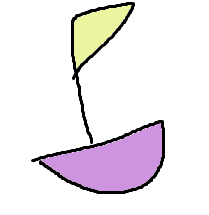

# Synchro Studio : Rebuilding the Flow

## Team: The Destroyers
##### Aileen Rosas
##### Bill Lactaoen
##### Claire Nguyen
##### Dalton Miltimore
##### Evan Tran

---

## Problem and Design Overview

Synchro Studio's interface presents several usability barriers for traffic engineers and planners. Users encounter
inefficiencies when navigating the Scenario Manager, incosistent menu layouts, and unintuitive data input
workflows. These issues hinder productivity and create a steep learning curve, especially for new users.

Our redesign addresses these challenges by creating a more cohesive and intuitive interface. Key improvements includes:
- A customizable Quick Access Pop-Up Bar for frequently used tools.
- Click-based map interactions for direct, contextual data input.
- A Consistent UI layout across all setting menus for better usability.

## Initial Prototype

---

## Design Walkthrough

### Adding Two Left Turn Lanes (Novice Task)

**Context:** A user wants to improve traffic flow at an intersection by adding left-turn lanes. This is a mid-complexity
 task common in congestion mitigation.

**Walkthrough:**
- Users click a road segment to bring up lane settings.
- A streamlined menu allows for quick adjustment of turn lanes.
- A hover-triggered submenu offers lane options.
- A dropdown lets users select the number of lanes.
- System logic prevents addings more lanes than possible for the connected road.

**Design Insight:** The Interface was generally intuitive, though participants were briefly confused by  the hover-triggered
submenu.

**Change Made:** We revised the interaction to improve feedback and are considering click-based submenu activation.

---

### Customizing QuickBar with Phasing Settings (Experienced Task)

**Context:** An experienced user wants to add Phasing Settings to their QuickBar to improve workflow efficiency in coordinating
traffic lights.

**Walkthrough:** 
- Clicking the customization buttons "+" or "-" activates QuickBar customization mode with a green outline.
- Users select or remove tools via direct clicks.
- Tooltips clarify the purpose of each button.

**Design Insight:** Users were confused by the green highlight and what it indicated.

**Change Made:** We added tooltips and visible labels/messages to clarify actions and improve feedback.

---

## Design Research and Key Insights

### Research Summary

**Goals:**
Identify key usability bottlenecks in Synchro Studio and understand user pain points.

**Methods:**
- Survey (2 responses)
- Interviews (two, 10 minutes each)

**Participants:** 
Students in TCE 327 with with actual Synchro Studio experience.

**Rationale:**
These methods offered insights into both novice and frequent user experiences, guiding redesign priorities.

### Key Insights

**Insight 1: Users Avoid Unfamiliar Tools**
- **Emergence:** Students reported using only what was taught in class and ignoring unexplained features.
- **Evidence:** "I don't touch the reports or random extra tabs because I don't know what they do."
"There are a bunch of things in the menus I've never clicked."
- **Impact:** We embedded tooltips, clearer labels, and simplified menues to enhance discoverability without
overwhelming users.

**Insight 2: UI Feels Overwhelming**
- **Emergence:** Students described the interface as bloated and visually cluttered, especially for first-time users.
- **Evidence:** "There's just too much going on and not enough help."
"Every setting is there, but it's overwhelming when you're new."
- **Impact:** We consolodated tool menus, implemented a customizable QuickBar, and emphasized clean visual groupings.

**Insight 3: Tasks Are Tedious and Fragmented**
- **Emergence:** Students felt that even small adjustments took too long, with constant back-and-forth between menus
and settings.
- **Evidence:** "It's not loading slow—it's just too many steps over and over"
"You need 3-4 tabs just to edit something small for 30 minutes."
**Impact:** We introduced direct map editing and feedback indicators to reduce context switching and give
users faster results from their actions.

---

## Iterative Design and Key Learnings

### Process Summary
Our design process followed an iterative structure of paper prototyping -> usability testing -> digital mockups -> heuristic evaluation.
The paper prototype helped us quickly identify interaction challenges and gather feedback on task flow. We then implemented changes in a
higher-fidelity Figma mockup and conducted a heuristic evaluation to refine interface elements and clarify feedback mechanisms.
This iterative approach helped us focus on:
- Clarifying visual feedback
- Simplifying task logic
- Improving interaction discoverability.

### Paper Prototype:
We tested our paper prototype with a group member acting as a participant and recorded critical incidents during two key tasks:
- Adding two left-turn lanes
- Customizing the QuickBar with Phasing Settings

### Digital Mockup:
The digital prototype was created in Figma, based on revisions from our usability testing. It incorporated clearer visual states, simplified
interactions, and refined feedback indicators. Another team then conducted a heuristic evaluation using Nielsen's 10 Usability Heuristics to guide further refinements.

### Rationale: 
This iterative process revealed that even small interaction details, like visual feedback or trigger behavior, can significantly affect user understanding and efficiency. Testing early with low-fidelity prototypes helped us quickly uncover usability issues without investing too much time in polish. Transitioning to digital mockups allowed us to refine those ideas with more realism and validate changes through heuristic evaluation. This cycle emphasized the value of early feedback, incremental improvements, and user-centered mindset in producing a more intuitive and effective design.

## Key Iteration Insights
**Insight 1:** Visual Feedback Improves Usability
- **Emergence:** During usability testing, participants were confused by the green arrow indicator when customizing the QuickBar.
- **Evidence:** Green arrow made users confused about what they did. The lack of a label or confirmation message caused uncertainty.
- **Change:** We added a visible label that explains the green state and what actions users can take.
- **Impact:** This clarification provided immediate feedback and improved user confidence in the customization mode.

**Insight 2:** Hover-Based Menus Created Confusion
- **Emergence:** In the lane editing task, participants were unsure why a second submenu appeared.
- **Evidence:** "Participant was unsure why it appeared. Eventually realized it was triggered by hover."
- **Change:** We switched the interactin from hover to click-based activation to make behavior more explicit and user-controlled.
- **Impact:** This reduced unexpected menu behavior and made the lane editing process more predictable.

**Insight 3:** Tool Management Should Be Modular
- **Emergence:** Users disliked last-in-first-out logic and lack of control over QuickBar tool removal.
- **Evidence:** Users were not able to remove a specific tool directly as it was LIFO.
- **Change:** We changed QuickBar tool management to click-based selection and removal, allowing users to manage individual tools.
- **Impact:** This improvement gave users more control and matched their expectations of modular, customizable toolbars.

---

## Technical and Soft Skills Gained

### Technical Skills
- Proficient use of Figma for creating interactive prototypes and high-fidelity mockups, including effective
  use of components and states to simulate interactions.
- Advanced wireframing techniques emphasizing clarity and usability.
- Conducting usability testing with real users, including planning tasks and logging critical incidents.
- Performing heuristic evaluations with Nielsen's heuristics to identify usability issues and suggest
  actionable improvements.
- Collaborative use of GitHub for version control and maintaining clean documentation using Markdown.
- Applying user-centered design principles to translate user research insights directly into deign desicions.
- Incorporating interaction design patterns such as feedback, menu behaviour refinement, and visual affordances
  to improve user experience.
- Visual design skills for creating consistent and clean UI layouts with appropriate grouping and spacing.

### Soft Skills
- Effective team collaboration in cross-functional design environment, including dividing roles such as facilitator,
  notetaker, and computer operator for usability testing.
- Strong communication skills for clearly articulating design ideas, user feedback, and usability findings to team members.
- Developing active listening through user interviews and usability test facilitation to deeply understand pain points.
- Iterative feedback integration by balancing user needs, technical constraints, and design goals across multiple prototype
  versions.
- Efficient time management to coordinate testing sessions, design revisions, and documentation within project deadlines.
- Enhanced problem-solving skills to address ambiguous user feedback and design conflicts.
- Cultivating a user-centered mindset, continuously prioritizing usability and accessability in design decisions.
